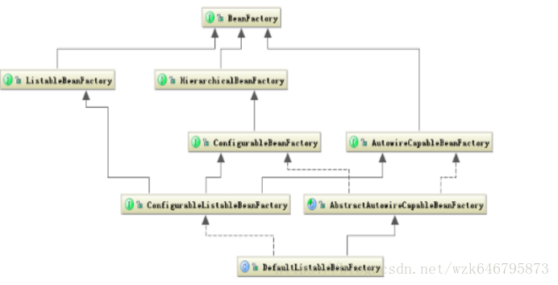

# https://blog.csdn.net/wzk646795873/article/details/79764870

```markdown
1.Spring是什么？
Spring 是一个开源框架，是为了解决企业应用程序开发复杂性而创建的。框架的主要优势之一就是其分层架构，分层架构允许您 选择使用哪一个组件，同时为 J2EE 应用程序开发提供集成的框架。
```

```markdown
2.Spring特点？
（1）IOC(控制反转)或DI（依赖注入）:明确定义组件的接口，独立开发各个组件，然后根据组件的依赖关系组装运行；即将创建及管理对象的权利交给Spring容器。Spring是一个轻型容器(light-weight Container)，其核心是Bean工厂(Bean Factory)，用以构造我们所需要的M(Model）。能够让相互协作的软件组件保持松散耦合。降低了业务对象替换的复杂性，提高了组件之间的解耦。

（2）AOP(面向切面编程)：通过预编译方式和运行期动态代理实现在不修改源代码的情况下给程序动态统一添加功能的一种技术。即系统级的服务从代码中解耦出来。例如：将日志记录，性能统计，安全控制，事务处理，异常处理等代码从业务逻辑代码中划分出来。允许你把遍布应用各处的功能分离出来形成可重用组件。
```

```markdown
3.Spring框架好处？
（1）控制反转：Spring通过控制反转实现了松散耦合，对象们给出它们的依赖，而不是创建或查找依赖的对象们。

（2）面向切面的编程(AOP)：Spring支持面向切面的编程，并且把应用业务逻辑和系统服务分开。

（3）MVC框架：Spring的WEB框架是个精心设计的框架，是Web框架的一个很好的替代品。

（4）低侵入式设计，代码污染极低,独立于各种应用服务器，基于Spring框架的应用，可以真正实现Write Once,Run Anywhere的承诺。

（5）集成能力强：集成多种优秀的开源框架。（Hibernate、Struts、Hessian等）。

（6）异常处理：Spring 提供方便的API把具体技术相关的异常（比如由JDBC，Hibernate or JDO抛出的）转化为一致的unchecked 异常。

（7）容器：Spring 包含并管理应用中对象的生命周期和配置。

（8）轻量：Spring 是轻量的，基本的版本大约2MB。
```

```markdown
4.Spring基本组成模块？
（1）CoreContain模块：Core、bean、context、Expression Language。

（2） Data Access/integration（集成）模块：JDBC、ORM、OXM、JMS、Transaction.

（3）Web模块：WEB、Web-Servle、Web-Struts、Web-Portlet。

（4）AOP、Aspects、Instrumentation、Test.

//加载应用上下文
ClassPathXmlApplicationContext context=new ClassPathXmlApplicationContext("ClassPath:spring.xml");
//获取bean
User user = context.getBean("user")
```
```markdown
5.Spring核心组件详解
Spring核心组件只有Core、Context、Beans三个。core包侧重于帮助类，操作工具，beans包更侧重于bean实例的描述。context更侧重全局控制，功能衍生。
```

```markdown
5.1Bean组件
Bean组件主要解决：Bean 的定义、Bean 的创建以及对 Bean 的解析。

开发者关心Bean创建，其他由Spring内部帮你完成。
1）Bean 的创建时典型的工厂模式，他的顶级接口是 BeanFactory，下图是这个工厂的继承层次关系：

Bean 的定义就是完整的描述了在 Spring 的配置文件中你定义的 <bean/> 节点中所有的信息，包括各种子节点。当 Spring 成功解析你定义的一个 <bean/> 节点后，在 Spring 的内部他就被转化成 BeanDefinition 对象。以后所有的操作都是对这个对象完成的。
```